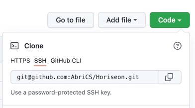

# Horiseon Refactor

This is the first portfolio task undertaken for UoB/Trilogy Coding Bootcamp 2021.

The purpose of this task was to review and revise the website code to ensure it meets quality and legislated standards.


## Description

Horiseon is a consultancy company supporting organisations with their social media marketing.
The Coronavirus Pandemic has forced the Horiseon Executive team to revise the efficacy of all their marketing tools
which includes Search Engine Optimisation (SEO) of the company's website.


## Getting Started

The following minimum requirements were secured;

- 5G Wifi
- Git hub repository.
```
 * This is an important step as Github safely stores the changes remotely and allow others to comment on the revisions.
 ```


### Initial steps

- Read the Brief
- Clarify the acceptance criteria.
- Log into Github
- Create a new Repository  
- Copy the SSH key to the local computer.
 <p> 
 * This is achieved by clicking the little boxes next to the Git Hub key. See the image below
 </p>




### Executing program

- Open the Terminal (cmd +T) on the local computer and create a home file for the Horiseon Project
- Open the file then type the following;
- **Git clone** then "paste the copied SSH key here"
- Type **Git add** followed by **Git Commit -m'** followed by "the name of the changes made inside the speech marks"

```
clone, add, commit, push
```

## Help

Advise for common problems or issues.

```
clone, add, commit, push, status
```

## Authors

- Jean McLeod
- <a href="mailto:AbriCSltd@gmail.com">email me</a>
- [@AbriCSltd](https://twitter.com/AbriCSltd)

## Version History

- <b>0.2  The Latest<b>
    - Click [here] (https://abrics.github.io/Horiseon)for the final release. 2021/12/12.

- 0.1
  - Initial Release 2021/12/02

## License

This project is licensed under the - [Creative Commons](https://creativecommons.org/licenses/by/2.0/uk/) License and is free to use and develop. Citation of the Author is recommended.

## Acknowledgments

Inspiration, code snippets, etc.

- [awesome-readme](https://github.com/matiassingers/awesome-readme)
- [NHSX](hhttps://www.nhsx.nhs.uk/ai-lab/ai-lab-programmes/ai-health-and-care-award/)
- [UoB-Trilogy](https://bootcamp.birmingham.ac.uk/coding/landing/?s=Google-Unbranded&pkw=%2Bcoding%20%2Bbootcamp&pcrid=454909807365&pmt=b&utm_source=google&utm_medium=cpc&utm_campaign=GGL%7CUNIVERSITY-OF-BIRMINGHAM%7CSEM%7CCODING%7C-%7COFL%7CTIER-1%7CALL%7CNBD-G%7CBMM%7CCore%7CBootcamp&utm_term=%2Bcoding%20%2Bbootcamp&s=google&k=%2Bcoding%20%2Bbootcamp&utm_adgroupid=106515441535&utm_locationphysicalms=1006524&utm_matchtype=b&utm_network=g&utm_device=c&utm_content=454909807365&utm_placement=&gclid=Cj0KCQiA2NaNBhDvARIsAEw55hh2jnTma9JMstvSPUY-bfd54sW6ixZrA6E7s-3D79KtXkNCsKTlA4caAuJeEALw_wcB&gclsrc=aw.ds)
- [TruTech](https://twitter.com/abricsltd/status/1163165497195712514?s=20)
